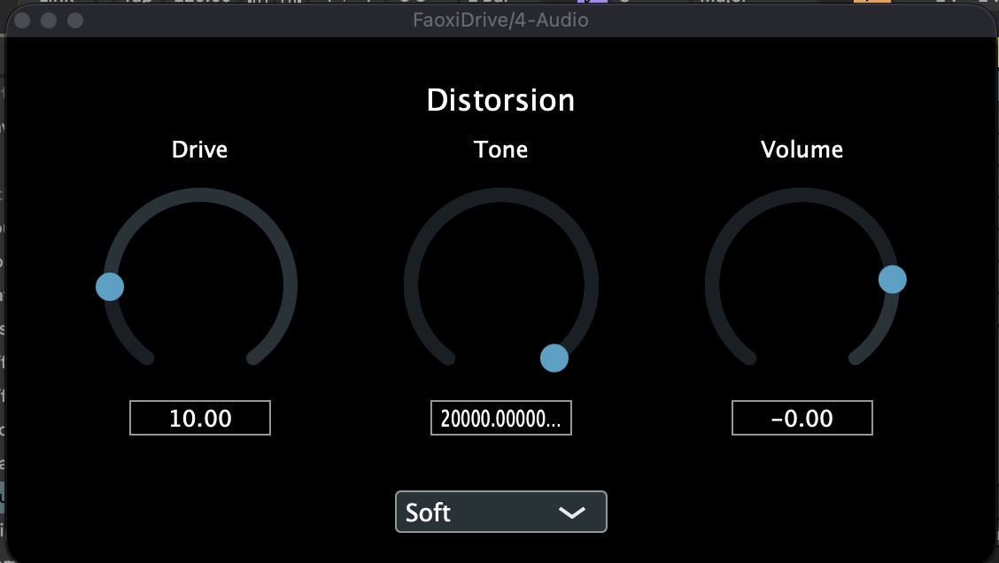

# FaoxiDrive

Plugin de distorsion audio écrit en C++ avec le framework [JUCE](https://juce.com), disponible en VST3, AU et application autonome.

C'est mon premier plugin : je l'ai écrit entièrement à la main pour apprendre la programmation audio temps réel, du traitement du signal jusqu'à l'interface.



## Fonctionnalités

- **Drive** (×1 à ×50) : gain appliqué avant la saturation
- **Mode** : écrêtage *Hard* (coupure nette) ou *Soft* (tangente hyperbolique, plus proche d'un ampli à lampes)
- **Tone** (500 Hz à 20 kHz) : filtre passe-bas pour adoucir les aigus générés par la distorsion
- **Volume** (−24 dB à +6 dB) : niveau de sortie
- Tous les paramètres sont automatisables dans le DAW et sauvegardés avec le projet

## Traitement du signal

```
Entrée → Drive → Écrêtage (Hard / Soft) → Filtre passe-bas → Volume → Sortie
```

**Écrêtage.** Le mode *Hard* borne chaque échantillon à un seuil fixe. Le mode *Soft* applique `tanh`, qui s'arrondit progressivement vers son plafond au lieu de casser net, et produit donc moins d'harmoniques aiguës. Les deux courbes étant symétriques, elles ne génèrent que des harmoniques impaires.

**Filtre de tonalité.** C'est un filtre passe-bas à un pôle, équivalent numérique d'un circuit RC du premier ordre :

```
y[n] = y[n-1] + a · (x[n] − y[n-1])
a    = 1 − exp(−2π · fc / fs)
```

Le coefficient `a` s'obtient à partir de la charge exacte du condensateur pendant une période d'échantillonnage. Comme le filtre garde en mémoire sa sortie précédente, chaque canal possède sa propre instance, afin que la gauche et la droite ne se contaminent pas.

La plage du potard Tone est déformée (*skew*) pour suivre la perception logarithmique des fréquences : le milieu de la course correspond à 3 kHz.

## Architecture du code

| Fichier | Rôle |
|---|---|
| `Source/distorsion.h/.cpp` | Classe `Distorsion` : drive et écrêtage, sans dépendance à JUCE |
| `Source/filtre.h/.cpp` | Classe `FiltrePasseBas` : filtre à un pôle, sans dépendance à JUCE |
| `Source/PluginProcessor.h/.cpp` | Paramètres (APVTS), chaîne de traitement dans `processBlock`, sauvegarde de l'état |
| `Source/PluginEditor.h/.cpp` | Interface : potards, menu du mode, étiquettes |

Les classes de traitement ne dépendent pas de JUCE : le processeur se contente de lire les paramètres et de leur déléguer le travail.

## Compilation

Prérequis : CMake 3.22 ou plus, un compilateur C++17, et [JUCE 8](https://github.com/juce-framework/JUCE).

```bash
git clone https://github.com/faoxii/FaoxiDrive.git
cd FaoxiDrive
cmake -B build -DJUCE_DIR=/chemin/vers/JUCE
cmake --build build
```

Par défaut, `JUCE_DIR` pointe vers `~/Documents/JUCE`. Après compilation, le plugin est copié automatiquement dans le dossier système des plugins.

Testé sur macOS (Apple Silicon) avec Ableton Live.

## Pistes d'amélioration

- Lisser les paramètres pour éviter les petits craquements quand on tourne un potard rapidement
- Ajouter du suréchantillonnage pour réduire l'aliasing produit par l'écrêtage
- Factoriser la configuration des potards dans l'interface

## Auteur

Mathis Bourguignon — étudiant ingénieur à l'IG2I (Centrale Lille), guitariste.
